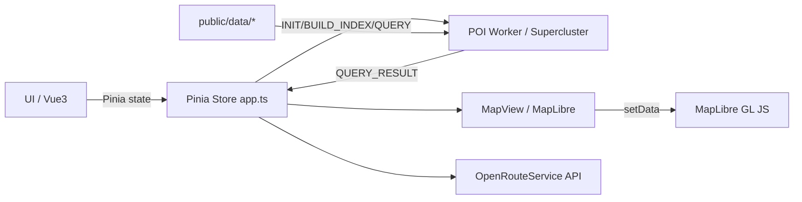

# SmartReach / cityaccess-plus-nanjing 交接文档

> 目标：基于当前仓库**真实内容与可运行验证结果**输出交接说明。所有关键描述均附文件路径与行号证据；无法验证的部分明确标注“未验证/不确定”。

## 0. 本次验证与结论摘要（可追溯）

- `npm run dev` **可启动**，但本次运行被 CLI 超时中断；日志显示 5173-5179 端口占用后切到 `http://localhost:5180/`（命令输出见「运行与验证结果」）。
- `npm run build` **通过**，但有 “chunk > 500k” 警告（见「运行与验证结果」）。
- `npm run test` **通过**，提示“无测试文件”（见「运行与验证结果」）。
- POI 渲染链路走 **WebWorker + Supercluster + 视窗 QUERY**（证据：`src/store/app.ts:210-445`、`src/workers/poi.worker.ts:438-548`、`src/components/MapView.vue:124-745`）。
- 默认不勾选类型：`selectedGroups` 初始化为空，只有勾选后才发 QUERY（证据：`src/store/app.ts:239-381`、`src/components/SidePanel.vue:200-268`）。

## 1. 运行与验证结果（命令 + 实际输出）

### 1.1 npm run dev
```
> cityaccess-plus-nanjing@0.1.0 dev
> vite --host

Port 5173 is in use, trying another one...
Port 5174 is in use, trying another one...
Port 5175 is in use, trying another one...
Port 5176 is in use, trying another one...
Port 5177 is in use, trying another one...
Port 5178 is in use, trying another one...
Port 5179 is in use, trying another one...

VITE v5.4.20  ready in 574 ms

➜  Local:   http://localhost:5180/
➜  Network: http://26.26.26.1:5180/
➜  Network: http://192.168.1.24:5180/
```
说明：命令被 CLI 超时终止（`timeout`），但 Vite 已准备就绪。**未在本次记录中验证页面实际渲染效果**（需要手动打开 5180 端口验证）。

### 1.2 npm run build
```
> cityaccess-plus-nanjing@0.1.0 build
> vue-tsc --noEmit && vite build

vite v5.4.20 building for production...
✓ 400 modules transformed.
(!) Some chunks are larger than 500 kB after minification.
✓ built in 6.11s
```
说明：构建通过，有 chunk 体积警告（需关注首屏加载体积）。

### 1.3 npm run test
```
> cityaccess-plus-nanjing@0.1.0 test
> vitest run --passWithNoTests

No test files found, exiting with code 0
```
说明：当前无测试用例。

## 2. 目录结构与关键文件清单

```
src/
  components/   # MapView/SidePanel/ResultPanel/UploadModal/HeaderBar
  pages/        # Home/About/Workbench
  store/        # app.ts（全局状态、POI 引擎、ORS）
  workers/      # poi.worker.ts（POI 解析 + supercluster）
  services/     # style.ts（底图样式）、ors.ts（ORS 接口）
  utils/        # coord.ts/spatial.ts/csv.ts/poiGroups.ts
  types/        # POI 类型与声明
public/
  data/         # POI 与分类规则数据
scripts/
  type_report.mjs
```

关键文件与职责：
- `src/store/app.ts`：全局状态与 POI 引擎、ORS 调用与等时圈/路线逻辑（`src/store/app.ts:92-610`）。
- `src/workers/poi.worker.ts`：POI 数据加载、分类、Supercluster 构建与 QUERY（`src/workers/poi.worker.ts:274-548`）。
- `src/components/MapView.vue`：MapLibre 初始化、图层/Source 管理、POI 渲染（`src/components/MapView.vue:596-776`）。
- `src/components/SidePanel.vue`：类型勾选、参数设置、导出入口（`src/components/SidePanel.vue:200-268`）。
- `src/components/ResultPanel.vue`：等时圈统计/列表/分页（`src/components/ResultPanel.vue:85-146`）。
- `src/services/ors.ts`：ORS 接口与本地 fallback（`src/services/ors.ts:29-183`）。
- `src/services/style.ts`：高德栅格底图样式（`src/services/style.ts:21-46`）。

## 3. 系统架构（高层）



**证据**：
- UI 初始化与 store：`src/main.ts:1-12`，`src/App.vue:7-15`
- Worker 协议与 POI 管道：`src/store/app.ts:210-445`，`src/workers/poi.worker.ts:438-548`
- MapLibre 渲染：`src/components/MapView.vue:596-776`
- ORS：`src/services/ors.ts:29-183`

## 4. 关键链路数据流

### 4.1 POI 渲染链路（重点）
**流程：**
1) 首屏：`selectedGroups` 初始化为空，不渲染 POI（`src/store/app.ts:239-381`）。
2) 勾选类型：SidePanel 通过 `v-model` 写入 `selectedGroups`（`src/components/SidePanel.vue:200-205`）。
3) Store 触发 `BUILD_INDEX`（`src/store/app.ts:346-372`）。
4) Worker 构建 Supercluster（`src/workers/poi.worker.ts:484-488`），返回 `INDEX_READY`。
5) Store 在 viewport ready 后发起 `QUERY`（`src/store/app.ts:383-445`）。
6) Worker 返回 `QUERY_RESULT`（`src/workers/poi.worker.ts:495-548`）。
7) MapView 对每个 group 的 source `setData`，渲染 cluster/point（`src/components/MapView.vue:464-555`）。

**聚合/样式策略：**
- Supercluster 参数：`radius: 70, maxZoom: 18, minZoom: 0`（`src/workers/poi.worker.ts:382-386`）。
- Cluster/point 分层与过滤：`['has','point_count']` / `['!', ['has','point_count']]`（`src/components/MapView.vue:332-372`）。
- Cluster 半径插值与上限/下限：`CLUSTER_RADIUS_EXPR`（`src/components/MapView.vue:77-108`）。
- 不同类别颜色映射：`GROUP_COLORS`（`src/utils/poiGroups.ts:19-34`，用于 `MapView` 的 layer paint）。

**范围框（hull/bbox）开关：**
- Store 默认 `showClusterExtent=false`（`src/store/app.ts:109-117`）。
- Worker 仅在 `includeHull=true` 才计算 hull（`src/workers/poi.worker.ts:495-536`）。
- MapView 仅在 `showClusterExtent=true` 时创建 hull layers（`src/components/MapView.vue:274-316`）。
> 当前 UI 未暴露开关（未在 `SidePanel` 中找到对应交互，`rg showClusterExtent` 仅出现在 MapView 与 store）。

### 4.2 等时圈链路
1) Map 点击 -> `generateIsochrones`（`src/pages/Workbench.vue:42-51`、`src/store/app.ts:502-514`）。
2) ORS 接口成功则返回，失败 fallback 本地 buffer（`src/services/ors.ts:39-68`、`131-149`）。
3) MapView `setIsochrones` 写入图层（`src/components/MapView.vue:493-576`）。
4) 圈内过滤：`withinIsochrone`（`src/utils/spatial.ts:39-64`）。

### 4.3 路径规划链路
1) 点击 POI -> `planRouteToPoi`（`src/pages/Workbench.vue:53-58`、`src/store/app.ts:516-548`）。
2) ORS directions + matrix（`src/services/ors.ts:70-129`），失败时本地直线 fallback（`src/services/ors.ts:152-183`）。
3) MapView 绘制 route line（`src/components/MapView.vue:522-539`）。

### 4.4 智能选址链路
1) 候选点导入：上传 GeoJSON/CSV -> `addCandidate`（`src/pages/Workbench.vue:122-139`、`src/store/app.ts:551-557`）。
2) 权重评分：`scoreCandidateSites` → `scoring`（`src/store/app.ts:571-576`、`src/utils/spatial.ts:110-159`）。
3) UI 展示 Top3（`src/components/ResultPanel.vue:48-71`）。
> 图表为占位文本（`candidate-card__chart-placeholder`，`src/components/ResultPanel.vue:61-62`）。

## 5. 环境变量与配置项（表格）

> `.env.example` 仅包含部分变量；更多变量在代码中直接读取，未出现在样例中（见下表“是否出现在 .env.example”）。

| 变量 | 用途 | 读取位置（文件/行号） | 缺失行为 | .env.example |
|---|---|---|---|---|
| `VITE_APP_NAME` | 左侧面板应用名 | `src/components/SidePanel.vue:198` | 缺失用 `SmartReach` | ✅（值疑似乱码） |
| `VITE_DEFAULT_CITY` | 导出 PNG 文件名 city | `src/pages/Workbench.vue:114` | 缺失用 `南京市` | ✅（值疑似乱码） |
| `VITE_DEFAULT_CENTER` | 初始地图中心 | `src/store/app.ts:73-79` | 缺失回退 118.796/32.06 | ✅ |
| `VITE_DEFAULT_ZOOM` | 初始缩放 | `src/store/app.ts:82-96` | 缺失回退 11 | ✅ |
| `VITE_MAP_STYLE_URL` | 覆盖 MapLibre style | `src/store/app.ts:82-97`、`src/components/MapView.vue:180-182` | 为空走默认底图 | ✅ |
| `VITE_AMAP_KEY` | 高德 key（仅日志提醒） | `src/components/MapView.vue:32-197` | 仅 warn，无实际拼接 | ✅ |
| `VITE_ORS_KEY` | ORS API Key | `src/services/ors.ts:36-68` | 缺失走本地 fallback | ✅ |
| `VITE_POI_URL` | POI 数据地址 | `src/store/app.ts:59` | 缺失默认 `/data/nanjing_poi.json` | ❌ |
| `VITE_COORD_SYS` | 地图坐标系 | `src/store/app.ts:64-67` | 缺失按 basemap 推断 | ❌ |
| `VITE_POI_COORD_SYS` | POI 坐标系 | `src/store/app.ts:68-70` | 缺失默认 WGS84 | ❌ |
| `VITE_BASEMAP_PROVIDER` | `amap/osm` 默认底图 | `src/store/app.ts:61-63`、`src/components/MapView.vue:29-31` | 缺失默认 `amap` | ❌ |
| `VITE_MIN_ZOOM`/`VITE_MAX_ZOOM` | 地图缩放上下限 | `src/components/MapView.vue:35-49` | 缺失默认 3/18 | ❌ |

**注意：** `.env.example` 中 `VITE_DEFAULT_CITY` 等中文在当前终端输出为乱码（`src/.env.example:1-7` 输出为 “鍗椾含甯?”），需确认文件编码与渲染问题（未验证是否影响运行）。

## 6. 外部服务与依赖

### 6.1 高德底图 / OSM
- AMap raster tiles：`src/services/style.ts:21-46`。
  - 使用固定 tile URL，不拼接 key。
- OSM fallback style：`src/components/MapView.vue:51-69`。
- MapLibre geocoder：`src/components/MapView.vue:615-647` 使用 Nominatim (`https://nominatim.openstreetmap.org`)。
  - 失败时返回空 FeatureCollection（见逻辑）。

### 6.2 OpenRouteService (ORS)
- Base URL：`https://api.openrouteservice.org/v2`（`src/services/ors.ts:29`）。
- 接口函数：
  - `isochrones`（`src/services/ors.ts:39-68`）
  - `directions`（`src/services/ors.ts:70-99`）
  - `matrix`（`src/services/ors.ts:101-129`）
- 缺 key 或请求失败时：本地 fallback 使用 turf 计算缓冲区/直线（`src/services/ors.ts:131-183`）。

## 7. POI 数据与分类规则

### 7.1 数据文件与格式
**本地存在：**
- `public/data/nanjing_poi.json`（本机存在，`Test-Path` 为 True）  
  - 但被 `.gitignore` 忽略（`/.gitignore:6`）。
- `public/data/type_rules.generated.json`、`public/data/type_coverage_report.md`、`public/data/type.xlsx` 均存在（本机检测为 True）。

**格式处理：**
Worker 支持两类输入：
1) GeoJSON FeatureCollection<Point>（读取 `geometry.coordinates` 与 `properties`）
2) 普通对象数组（探测经纬度字段）
> 详见 `buildPoints`（`src/workers/poi.worker.ts:274-348`）。

**字段映射：**
Worker 在 `buildPoints` 中读取：
- name：`NAME_KEYS`（`src/workers/poi.worker.ts:110-113`）
- type：`TYPE_KEYS`（`src/workers/poi.worker.ts:112-113`）
- lon/lat：`LON_KEYS` / `LAT_KEYS`（`src/workers/poi.worker.ts:110-112`）

**地名地址剔除：**
- `type_group === 'address'` 会在 `buildPoints` 中直接过滤（`src/workers/poi.worker.ts:298-339`）。
- Store 中也会过滤 `address`（`src/store/app.ts:346-348`）。

### 7.2 分类规则
来源：  
1) `public/data/type_rules.generated.json`（优先使用）  
2) `DEFAULT_RULES` 作为 fallback（`src/workers/poi.worker.ts:43-108`）

分类流程：
- `classifyType` -> 按 L1 映射 + L2 override + priority 选取（`src/workers/poi.worker.ts:185-207`）。

规则生成脚本：
`scripts/type_report.mjs`（`scripts/type_report.mjs:1-200`），从 `public/data/type.xlsx` 或 `data/type.xlsx` 生成：
- `public/data/type_rules.generated.json`
- `public/data/type_coverage_report.md`

**注意：**
`public/data/README.md` 说明“生成文件不提交”，但当前仓库已包含 `type_rules.generated.json` 与 `type_coverage_report.md`（与 README 描述不一致，需对齐）（`public/data/README.md:12-14`）。

## 8. Worker 协议（POI 引擎）

**消息类型（Worker）：**
- `INIT`：加载 POI + rules（`src/workers/poi.worker.ts:456-476`）
  - 响应 `INIT_DONE`：`total/typeCounts/rulesMeta`
- `BUILD_INDEX`：按 group 构建索引（`src/workers/poi.worker.ts:484-492`）
  - 响应 `INDEX_READY`
- `QUERY`：按 bbox/zoom/groups 返回聚合数据（`src/workers/poi.worker.ts:495-548`）
  - 响应 `QUERY_RESULT`
- `EXPAND`：cluster expansion zoom（`src/workers/poi.worker.ts:552-560`）

**Store 对应处理：**
`initPoiEngine` / `setSelectedGroups` / `requestViewportPois`（`src/store/app.ts:210-445`）。

## 9. 功能完成度矩阵（真实状态）

| 模块 | 状态 | 证据 | 可用操作 | 缺口/风险 |
|---|---|---|---|---|
| 基础框架/路由/布局 | 已完成 | `src/main.ts:1-12`, `src/router/index.ts:1-28` | Home/Workbench/About 路由 | 无测试覆盖 |
| 地图底图（高德） | 已完成 | `src/services/style.ts:21-46` | 默认 AMap raster | `VITE_AMAP_KEY` 未用于 URL；如需加密需改 |
| POI 加载/分类/勾选显示 | 已完成 | `src/store/app.ts:210-445`, `src/workers/poi.worker.ts:274-548`, `src/components/SidePanel.vue:200-268` | 勾选类型→聚合显示 | 大量类别全选可能影响性能 |
| 聚合显示（cluster/point） | 已完成 | `src/components/MapView.vue:274-555` | 缩放聚合 / 单点 | chunk 大小警告 |
| 等时圈 | 已完成（含 fallback） | `src/services/ors.ts:39-149`, `src/store/app.ts:502-514` | 地图点击生成 | ORS key 缺失时为简化 buffer |
| 圈内找点 | 已完成（bbox+within） | `src/utils/spatial.ts:39-64` | 圈内列表 | 性能受候选量影响 |
| 路径规划 | 已完成（含 fallback） | `src/services/ors.ts:70-183`, `src/store/app.ts:516-548` | 点击 POI 路径 | ORS key 缺失时为直线 |
| 智能选址 | 部分完成 | `src/utils/spatial.ts:110-159`, `src/components/ResultPanel.vue:48-71` | Top3 列表 | UI 图表为占位 |
| 上传/导出 | 已完成 | `src/components/UploadModal.vue`, `src/pages/Workbench.vue:60-139` | 导出 CSV/PNG | CSV 仅导出圈内 |
| 错误提示/空态/加载态 | 部分完成 | `src/components/SidePanel.vue:46-48`, `src/store/app.ts:296-304` | loading 提示 | UI 错误提示有限 |
| 测试/质量保障 | 未开始 | `package.json:9-16` | `npm run test` 通过（无测试） | 回归风险高 |

## 10. 已知问题与风险清单（可执行建议）

1) **编码/乱码风险**  
   - 现象：`.env.example` 与多处 UI 文案在当前终端显示为乱码（如 `VITE_DEFAULT_CITY`）。  
   - 证据：`.env.example:1-7`；多个 `.vue` 输出中中文显示为乱码（`SidePanel.vue`、`MapView.vue`、`ResultPanel.vue`）。  
   - 建议：统一 UTF-8（无 BOM）保存，并在 README/贡献指南中说明；对乱码来源进行一次编码校验。  

2) **生成文件与 README 描述不一致**  
   - 现象：`public/data/README.md` 说明生成文件不提交，但仓库已提交 `type_rules.generated.json` 和 `type_coverage_report.md`。  
   - 证据：`public/data/README.md:12-14` 与仓库文件清单。  
   - 建议：更新 README 或调整 `.gitignore` 与提交策略。  

3) **大 POI 数据未入库**  
   - 现象：`public/data/nanjing_poi.json` 被 `.gitignore` 排除。  
   - 证据：`.gitignore:6`、本机文件存在但不跟踪。  
   - 建议：在交接中明确“需自行准备数据”；若需云端同步，考虑 Git LFS。  

4) **Chunk 体积警告**  
   - 现象：`npm run build` 提示 chunk > 500k。  
   - 证据：构建输出日志（见第 1.2）。  
   - 建议：按需拆分 Workbench/MapView 相关模块或使用动态 import。  

5) **无自动化测试**  
   - 现象：`npm run test` 无测试文件。  
   - 证据：测试输出（见第 1.3）。  
   - 建议：至少加入 smoke test 或关键链路 e2e。  

## 11. 下一步开发路线图（P0/P1/P2）

### P0（稳定性）
- **补齐 .env.example**（新增 `VITE_POI_URL/VITE_BASEMAP_PROVIDER/VITE_COORD_SYS/VITE_POI_COORD_SYS/VITE_MIN_ZOOM/VITE_MAX_ZOOM`）  
  - 目标：新环境可启动不踩坑  
  - 相关文件：`.env.example`、`src/store/app.ts:59-70`、`src/components/MapView.vue:35-49`  
  - 验收：无额外 README 手动说明即可启动

- **统一编码与文案**  
  - 目标：消除乱码  
  - 相关文件：`.env.example`、`src/components/*.vue`  
  - 验收：终端与浏览器均显示正常中文

### P1（体验完善）
- **加入“显示聚合范围”开关 UI**  
  - 目标：按需启用 hull/bbox（默认关）  
  - 相关文件：`src/store/app.ts:109-117`、`src/components/MapView.vue:274-563`、`src/components/SidePanel.vue`  
  - 验收：开关切换后显示/隐藏范围框

- **优化 ResultPanel 统计**  
  - 目标：显示更清晰的 type 统计排序与空态  
  - 相关文件：`src/components/ResultPanel.vue:105-137`

### P2（质量与性能）
- **引入测试**  
  - 目标：覆盖 POI 渲染/Worker 协议/ORS fallback  
  - 相关文件：`tests/**`  
  - 验收：`npm run test` 有实际用例

- **进一步拆分 Workbench 代码块**  
  - 目标：降低首屏 JS 体积  
  - 相关文件：`src/pages/Workbench.vue`、`vite.config.ts`  
  - 验收：build 警告消失或减少

## 12. 最小可复现步骤（供下任开发）

1) 准备数据：
   - 放置 `public/data/nanjing_poi.json`（若文件缺失需自行准备，见 `public/data/README.md:5-10`）
   - 放置 `public/data/type.xlsx`（用于 `npm run type:report`）
2) 安装依赖：
   - `npm install`
3) 启动开发：
   - `npm run dev`
4) 打开：
   - `http://localhost:5180/`（若 5173-5179 占用，Vite 会自动换端口）
5) 验证：
   - 进入 `/workbench`
   - 勾选 POI 类型观察聚合显示
   - 点击地图生成等时圈

---

## 附录：关键依赖版本（来自 package.json）

- vue `^3.4.21`
- pinia `^2.1.7`
- vue-router `^4.5.1`
- maplibre-gl `^5.0.0`
- @maplibre/maplibre-gl-geocoder `^1.4.0`
- @turf/turf `^7.1.0`
- axios `^1.6.8`
- file-saver `^2.0.5`
- supercluster `^8.0.1`
- xlsx `^0.18.5`

证据：`package.json:13-28`
